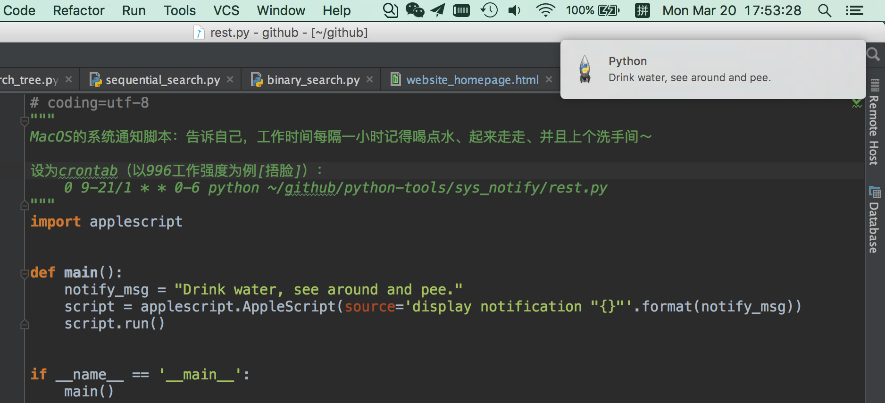
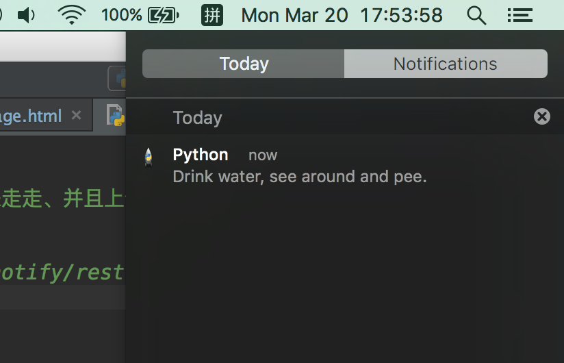

# python tools
---

日常使用的自制工具

- ssh/pyssh.py
    - SSH连接工具
    - json文件记录用户密码
    - 支持代理跳转
- code/code_counter.py
    + 代码行数统计
- alarm-clock
    + 自制命令行闹钟
    + 专治懒人，必须起床敲命令行关闭闹钟
    + 标签功能
    + 支持定义只在工作日、周末、或者具体周一／周二闹铃
    + 热更新
    + 作为守护进程运行
- sys_notify
    + MacOS的系统通知脚本：告诉自己，工作时间每隔一小时记得喝点水、起来走走、并且上个洗手间～
        > Drink water, see around and pee.
- qiniu_manager
    + qn_upfile.py
        - 一句命令行上传文件到七牛云
        
        
### SSH连接工具
展示主机列表：

    $ python pyssh.py -l
              Host          |          User          |         Alias
    --------------------------------------------------------------------------
          10.17.35.80       |         tangyk         |           80
         132.122.70.138     |          noce          |          138
         132.122.69.126     |          root          |          126

    
连接主机：
    
    $ python pyssh.py 80
    ######## Login Success! ########
    
    [tangyk@host-9-80 ~]$
    

通过自定义的json文件保存主机列表，如下示例：
    
    $ cat sample.json
    {
      "192.168.0.2": {
        "username": "tangyk",
        "password": "tangyk",
        "alias": "host-01"
        "proxy": "192.168.0.3"
      }
    }
     
      
### 代码统计
用法

    $ python code_counter.py
    Usage:
        python code_counter.py [OPTIONS] PROJECT_ROOT_DIR
    
    Options
    -p        Python files only, deafult value
    -j        Java files only
    -g        Golang files only
    -c        C/C++ files only
    
    $ python code_counter.py -p ssh/
    876
    $ pycode -p alarm-clock/
    160
    
    
    
### 命令行闹钟
用法

    $ python alarm.py -h
    Usage:
        python alarm.py [options]
    
    Simple Alarm Clock
    
    Options:
      -h, --help            show this help message and exit
      -l, --list            list all alarm clocks
      -a, --all-run         run all alarm clocks
      -t RUN_LABEL, --tag-only=RUN_LABEL
                            run alarm clocks by label
      -k, --kill-clock      kill all clocks
      --kill-music          kill ringing tones
      -r, --reload          reload config from file: clock.json
      -d, --daemon          run as daemon
      --status              show status     
         
    # 通过json文件编辑闹钟，查看闹钟配置示例         
    $ python alarm.py -l
    {
        "clocks": [
            {
                "filter": [
                    "weekday"
                ],
                "time": "06:00:00"
            },
            {
                "filter": [
                    "weekend"
                ],
                "time": "09:00",
                "status": "off",
                "label": "kidding"
            }
        ],
        "default_ringtone": "gao_bai_qi_qiu.mp3",
        "default_filter": ["everyday"],
        "default_status": "on",
        "default_label": "default",
        "default_ringtone_folder": "/Users/eacon/Documents/music"
    }   
          
    # 开启闹钟(加-d作为守护进程运行，-a运行所有闹钟)
    $ python alarm.py -a -d
    # -t标签，指定只运行"work"的闹钟
    $ python alarm.py -t work
    
    # 关掉正在吵你的音乐
    $ python alarm.py --kill-music
    
    # 关掉所有闹钟
    $ python alarm.py -k
    
    # 修改闹钟配置后，重载配置
    $ pythoon alarm.py -r
    
日志：

    2017-01-20 18:28:22,573 [pid:699] [tid:140735241310208] [pyalarm] [INFO] Start as daemon process, pid file: /tmp/eacon-alarm.pid
    2017-01-20 18:28:22,576 [pid:701] [tid:140735241310208] [pyalarm] [INFO] Run all alarm...
    2017-01-20 18:28:22,577 [pid:701] [tid:140735241310208] [pyalarm] [INFO] Start a new loop...
    2017-01-20 18:28:22,580 [pid:701] [tid:140735241310208] [pyalarm] [DEBUG] Clock(id:4425163024)-Thread: name:Thread-1, ident:None, interval:68, isAlive:<bound method _Timer.isAlive of <_Timer(Thread-1, initial)>>, finished:<threading._Event object at 0x107c813d0>, isDaemon:False,
    2017-01-20 18:28:22,584 [pid:701] [tid:140735241310208] [pyalarm] [INFO] A new clock(id:4425519376) is started! Clock time:18:29:00, ringtone: /Users/eacon/Documents/music/gao_bai_qi_qiu.mp3
    2017-01-20 18:28:22,585 [pid:701] [tid:140735241310208] [pyalarm] [DEBUG] Clock(id:4425519440)-Thread: name:Thread-2, ident:None, interval:93022, isAlive:<bound method _Timer.isAlive of <_Timer(Thread-2, initial)>>, finished:<threading._Event object at 0x107c815d0>, isDaemon:False,
    2017-01-20 18:28:22,587 [pid:701] [tid:140735241310208] [pyalarm] [INFO] A new clock(id:4425519440) is started! Clock time:16:38:00, ringtone: /Users/eacon/Documents/music/gao_bai_qi_qiu.mp3
    2017-01-20 18:28:22,588 [pid:701] [tid:140735241310208] [pyalarm] [DEBUG] Clock(id:4425519504)-Thread: name:Thread-3, ident:None, interval:96202, isAlive:<bound method _Timer.isAlive of <_Timer(Thread-3, initial)>>, finished:<threading._Event object at 0x107c817d0>, isDaemon:False,
    2017-01-20 18:28:22,589 [pid:701] [tid:140735241310208] [pyalarm] [INFO] A new clock(id:4425519504) is started! Clock time:15:45:00, ringtone: /Users/eacon/Documents/music/gao_bai_qi_qiu.mp3
    
    2017-01-20 18:29:30,236 [pid:772] [tid:123145306509312] [pyalarm] [INFO] Clock(id:4425163024) is playing music: /Users/eacon/Documents/music/gao_bai_qi_qiu.mp3

    2017-01-20 18:30:03,792 [pid:1003] [tid:140735241310208] [pyalarm] [INFO] Reload...
    2017-01-20 18:30:03,792 [pid:1003] [tid:140735241310208] [pyalarm] [INFO] Start killing process...
    2017-01-20 18:30:03,792 [pid:1003] [tid:140735241310208] [pyalarm] [INFO] Removing pid file...
    2017-01-20 18:30:03,793 [pid:1003] [tid:140735241310208] [pyalarm] [INFO] Process is killed!
    2017-01-20 18:30:03,793 [pid:1003] [tid:140735241310208] [pyalarm] [INFO] Start as daemon process, pid file: /tmp/eacon-alarm.pid
    2017-01-20 18:30:03,796 [pid:1005] [tid:140735241310208] [pyalarm] [INFO] Run all alarm...
    2017-01-20 18:30:03,796 [pid:1005] [tid:140735241310208] [pyalarm] [INFO] Start a new loop...
    2017-01-20 18:30:03,799 [pid:1005] [tid:140735241310208] [pyalarm] [DEBUG] Clock(id:4393967888)-Thread: name:Thread-1, ident:None, interval:7, isAlive:<bound method _Timer.isAlive of <_Timer(Thread-1, initial)>>, finished:<threading._Event object at 0x105e6a3d0>, isDaemon:False,
    2017-01-20 18:30:03,800 [pid:1005] [tid:140735241310208] [pyalarm] [INFO] A new clock(id:4393967888) is started! Clock time:18:30:10, ringtone: /Users/eacon/Documents/music/gao_bai_qi_qiu.mp3
    2017-01-20 18:30:03,800 [pid:1005] [tid:140735241310208] [pyalarm] [DEBUG] Clock(id:4393967952)-Thread: name:Thread-2, ident:None, interval:93123, isAlive:<bound method _Timer.isAlive of <_Timer(Thread-2, initial)>>, finished:<threading._Event object at 0x105e6a5d0>, isDaemon:False,
    2017-01-20 18:30:03,800 [pid:1005] [tid:140735241310208] [pyalarm] [INFO] A new clock(id:4393967952) is started! Clock time:16:38:00, ringtone: /Users/eacon/Documents/music/gao_bai_qi_qiu.mp3
    2017-01-20 18:30:03,801 [pid:1005] [tid:140735241310208] [pyalarm] [DEBUG] Clock(id:4393968016)-Thread: name:Thread-3, ident:None, interval:96303, isAlive:<bound method _Timer.isAlive of <_Timer(Thread-3, initial)>>, finished:<threading._Event object at 0x105e6a7d0>, isDaemon:False,
    2017-01-20 18:30:03,801 [pid:1005] [tid:140735241310208] [pyalarm] [INFO] A new clock(id:4393968016) is started! Clock time:15:45:00, ringtone: /Users/eacon/Documents/music/gao_bai_qi_qiu.mp3

### 建议用法
赋予脚本执行权限：

    $ chmod +x alarm.py
    
添加软连接，方便全局使用：
    
    $ ln -s <path-to-alarm.py> </usr/local/bin/pyalarm>
    $ pyalarm -h
    
## MacOS通知脚本
1. sys_notify/rest.py
    - MacOS的系统通知脚本：告诉自己，工作时间每隔一小时记得喝点水、起来走走、并且上个洗手间～
    - 示例：
        - 
        - 
        
        
## 七牛文件上传
1. qiniu_manager/qn_upfile.py  
    参数分别为：本地文件路径、上传文件key、七牛bucket空间名
    
            python qn_upfile.py <file_path> <key> [bucket_name]
    
    示例：
    
        
        eacon•~/Downloads» qn_upfile eacon-logo.png image/2017/05/eacon-logo.png
        Upload detail:
            bucket-name: static-tangyingkang-com
            key-name: image/2017/05/eacon-logo.png
            local-file: /Users/eacon/Downloads/eacon-logo.png
        Result:
            {u'hash': u'FlnYuBK8D0CH8Dh52ZatUJMpUF6O', u'key': u'image/2017/05/eacon-logo.png'}
            exception:None, status_code:200, _ResponseInfo__response:<Response [200]>, text_body:{"hash":"FlnYuBK8D0CH8Dh52ZatUJMpUF6O","key":"image/2017/05/eacon-logo.png"}, req_id:f2AAALcgaIL55cAU, x_log:body:12;s.ph;s.put.tw;s.put.tr:11;s.put.tw;s.put.tr:14;s.ph;PFDS:15;PFDS:15;rs2_0.sel/not found;rs1_0.sel/not found;rs2_0.ups;rwro.ups:1;mc.s/500;RS:2;rs.put:2;rs-upload.putFile:18;UP:33
        Url:
            http://cdn.tangyingkang.com/image/2017/05/eacon-logo.png